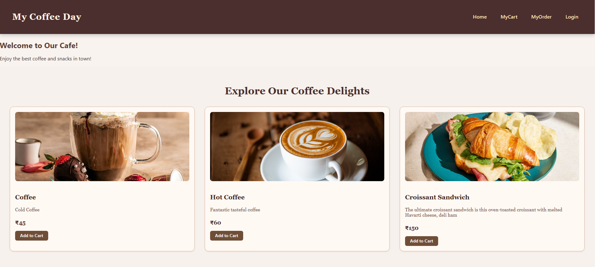

# ☕ MERN Café Store

<div align="center">
  
</div>

<p align="center">
  <a href="https://your-deployed-cafe-store-link">
    
  </a>
  <a href="LICENSE">
    
  </a>
  <a href="https://github.com/yourusername/mern-cafe-store/stargazers">
    
  </a>
</p>

---

## 🎯 Project Overview

<div style="background-color:#fff8f0; padding:15px; border-radius:10px;">
MERN Café Store is a <b>full-stack e-commerce web application</b> tailored for a café business.  
It enables customers to:
<ul>
  <li>Browse and explore café products</li>
  <li>Add items to their cart</li>
  <li>Place orders after login</li>
</ul>
It also features a <b>role-based authentication system</b> for <b>Customers</b> and <b>Admins</b>, ensuring smooth business operations and delightful shopping experiences.
</div>

---

## ✨ Key Features

<table>
<tr>
<th>Feature</th>
<th>Description</th>
<th>Icon</th>
</tr>
<tr>
<td>Customer Registration & Login</td>
<td>Secure authentication for users</td>
<td>👤</td>
</tr>
<tr>
<td>Product Browsing</td>
<td>View café menu items with details</td>
<td>📋</td>
</tr>
<tr>
<td>Shopping Cart</td>
<td>Add, view, and remove items before ordering</td>
<td>🛒</td>
</tr>
<tr>
<td>Order Placement</td>
<td>Place orders after logging in</td>
<td>📝</td>
</tr>
<tr>
<td>Order History & Status</td>
<td>Track previous and current orders</td>
<td>📦</td>
</tr>
<tr>
<td>Admin Dashboard</td>
<td>Manage users, products, and orders</td>
<td>🛠️</td>
</tr>
</table>

---

## 🌐 Live Demo

<div align="center">
  <a href="https://your-deployed-cafe-store-link">Click here to view the Live Demo 🚀</a>
</div>

---

## 🛠️ Tech Stack

<div style="display:flex; flex-wrap:wrap; gap:10px;">
  
  
  
  
  
</div>

---

## 📂 Project Structure

```plaintext
mern-cafe-store/
├─ backend/
│   ├─ routes/        # API routes
│   ├─ controllers/   # Business logic
│   ├─ models/        # Mongoose schemas
│   └─ server.js
├─ frontend/
│   ├─ src/
│   │   ├─ components/ # UI Components
│   │   ├─ pages/      # Views
│   │   └─ App.js
├─ public/            # Static assets
├─ README.md
└─ package.json

⚙️ Installation & Setup
1️⃣ Clone Repository
git clone https://github.com/yourusername/mern-cafe-store.git
cd mern-cafe-store

2️⃣ Backend Setup
cd backend
npm install


Create a .env file in the backend folder:

MONGO_URI=your_mongodb_connection_string
JWT_SECRET=your_jwt_secret_key
PORT=5000


Run the server:

npm start

3️⃣ Frontend Setup
cd ../frontend
npm install
npm start

🔄 System Workflow
<div align="center">  </div>
flowchart TD
    A[Customer Browses Products] --> B[Add to Cart]
    B --> C[Login/Register]
    C --> D[Place Order]
    D --> E[Order Stored in MongoDB]
    E --> F[Admin Reviews & Updates Status]
    F --> G[Customer Views Status in Dashboard]

📌 API Endpoints
Method	Endpoint	Description
POST	/api/users/register	Register a new user
POST	/api/users/login	User login (returns JWT)
GET	/api/products	Get all products
POST	/api/products	Admin: Add new product
DELETE	/api/products/:id	Admin: Delete product
POST	/api/orders	Place new order
GET	/api/orders	Admin: View all orders
PUT	/api/orders/:id	Admin: Update order status
GET	/api/users	Admin: View all users
DELETE	/api/users/:id	Admin: Delete user
🤝 Contribution

Fork the repository

Create a new branch:

git checkout -b feature/your-feature


Commit changes:

git commit -m "Add your message"


Push to your branch:

git push origin feature/your-feature


Open a Pull Request 🎉

🙏 Acknowledgements

MERN Stack community

JWT Authentication docs

MongoDB Atlas

Made with ❤️ by Ananta Kumari (Nova)
